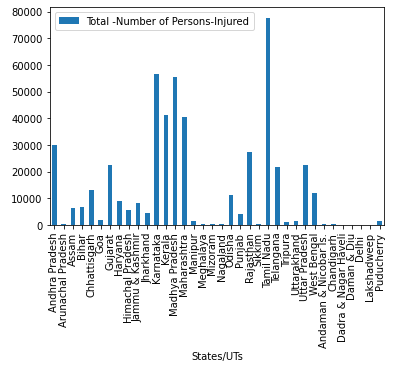
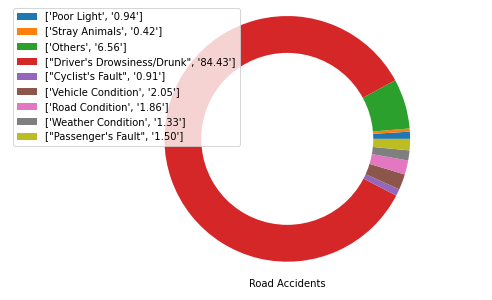

# Road-Accidents
Analysis of Road accidents in India and finding their causes to prevent them
## Road-Accident-Analysis in India
### Problem Statement: “Aim of this project is to analyse the given accident data from a particular region and to obtain inferences regarding the influences and contributions of several attributes to the severity of an accident and hence provide specific measures in order to reduce the rate of these accidents”
A dataset obtained from previously occurring accidents in all the states of India is taken from which inferences are drawn and using  these insights in minimizing the rate of accidents.

##Fig- This plot is showing the frequency of road accidents happening in different states and regions of the country.And it can be observed that Tamil Nadu and Maharashtra encountered maximum number of accidents

##Fig:This bar graph plot shows the total number of persons killed in different states and UTs.Uttar Pradesh, Tamil Nadu and Maharashtra are more affected areas with higher death rate.

##Fig- This bar graph plot shows the total number of persons injured in different states and UTs.Tamil Nadu, Karnataka and Madhya Pradesh are more affected areas with higher injured rate.

## Fault Rate

The chart tells us that it is the driver’s fault over 80% of the time. Contrary to popular belief, the fault does fall on the driver in most cases. It is also important to note other factors like stray animals, light, road and weather conditions, etc. also play a part in these accidents taking place.

## Alarm and Drowsiness Detector
## ALGORITHM
- Setup a camera that monitors a stream for faces.
- If a face is found, we apply facial landmark detection and extract the eye regions
- Now that we have the eye regions, we can compute the eye aspect ratioto determine if the eyes are closed
- If the eye aspect ratio indicates that the eyes have been closed for a sufficiently long enough amount of time, we’ll sound an alarm to wake up the driver.

## TECHNOLOGY USED:
>OpenCV,Python,dlib.

## CONCLUSION
Driving with your eyes closed, even for a second, is dangerous, so extra special precautions need to be taken while driving.

As the results show, our drowsiness detector is able to detect when the driver is at risk of dozing off and then plays a loud alarm to grab his/her attention.
